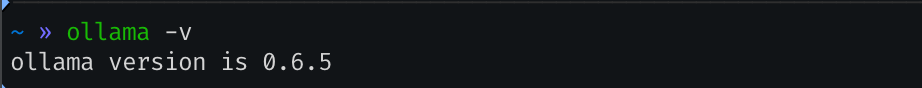
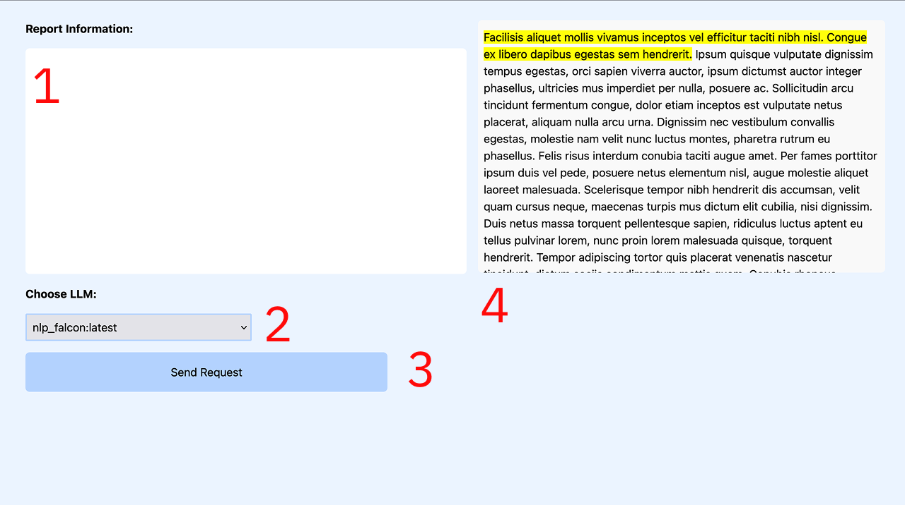

# User Manual

## Prerequisites:
The radiology tool requires for Ollama to be installed. 


1. Click the link [here](https://ollama.com/download) to go to the Ollama homepage.
2. Click the download button for your specific operating system.
3. Navigate through the setup window. 
4. Run the Ollama background server(daemon) using `ollama serve`.
5. To test whether Ollama has been correctly downloaded, open up a Terminal window. Type in `ollama -v` to print out the Ollama version. 
 
6. To download models from the Modelfiles present in the modelfiles directory, you can use the command 
```ollama create <name> -f modelfiles/<modelname>.Modelfile```
 This downloads a model on your computer, by using the Modelfile as a blueprint. 
 For example, to create a model called `mistralNLP` from the modelfile `mistral.Modelfile` located in the `modelfiles` directory in this repository, you can use the command `ollama create mistralNLP -f modelfiles/mistral.Modelfile`.


## Running the radiology tool.
> Note: Setting up this tool requires entering specific commands, and may be confusing to someone who has never used the terminal before. 
1. Run the Ollama server using `ollama serve &`. This allows you to run the Ollama server in the background. 
2. Rename the `.env.example` file to `.env`. This is because the Flask server is inside the `webview` folder.
3. Activate the conda environment using the command`conda activate hons`. 
4. After making sure that the conda environment is activated, run `flask run`, inside the honours project folder, to start the server. 
5. Navigate to this URL [http://127.0.0.1:5000/](http://127.0.0.1:5000/). This is where the Flask server will run the application. 


## Using the radiology tool
The screenshot below shows what the initial local application looks like when first started up.

1. This is the location where the report is pasted into. 
2. This is a dropdown menu of all the LLMs present on the user's machine. It currently shows an LLM called `nlp_falcon:latest`.
3. This is a button called Send Request, which sends a request to the Flask server, giving the report information and the model name to be used for generation. 
4. This is some highlighted placeholder text, that changes when the request is processed through the server, and the server outputs a response. 


